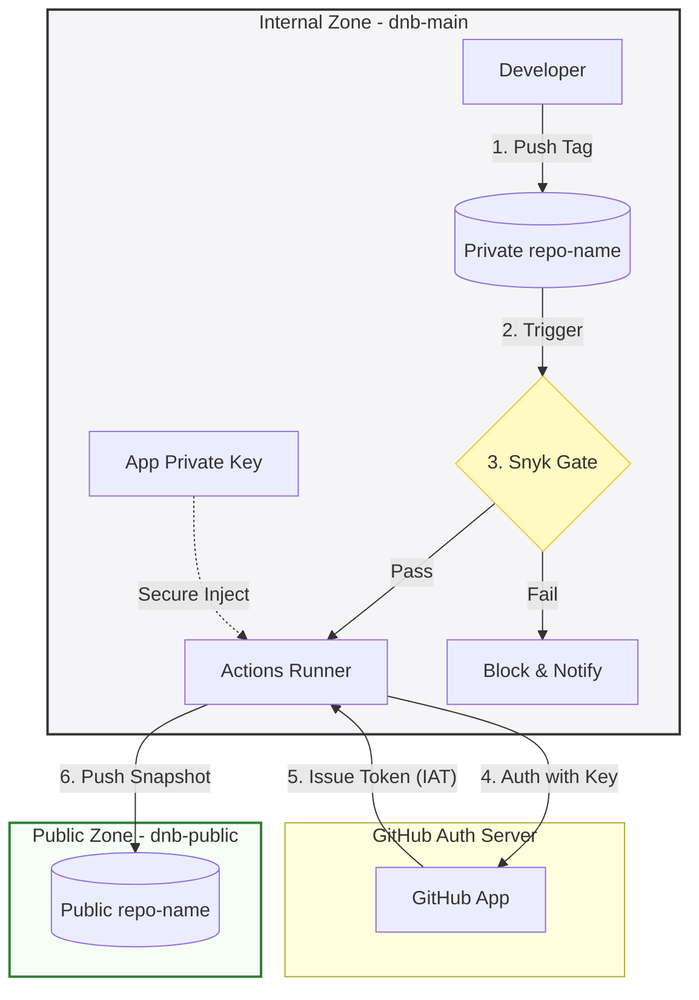
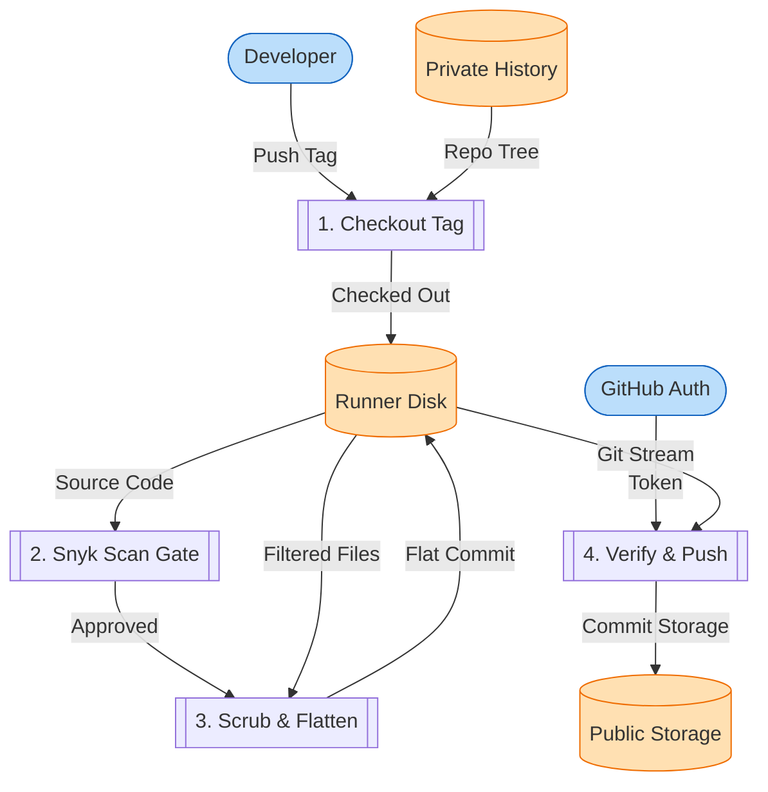

# ice-dnb-public-sync: Secure Public Code Export Pipeline

> `v1.0.0` | `2026-06-12` | Integrated Cloud Engineering (ICE)
>
> **Status:** Production | **Owner:** `group:ghe-6758-dnbcloudengineering`

---

## 1. Project Overview & Trust Boundaries

The `ice-dnb-public-sync` pipeline is a secure replication and publishing mechanism designed to sync a production-ready, open-source-compliant codebase snapshot from our private internal workspace (`dnb-main`) to our public target organization (`dnb-public`).

To protect internal assets and avoid accidental leaks of keys, private history, or proprietary modules, the system establishes a strict unidirectional trust boundary:



*   **Internal Zone (`dnb-main`):** Private source repository containing full commit history, internal development/engineering documentation, and secrets. All Snyk gating and security checks run here.
*   **Public Zone (`dnb-public`):** Public organization hosting the public repository. It is a passive, clean, flattened storage endpoint with no historical development logs.

---

## 2. Pipeline Data Flow

The codebase undergoes several sanitization stages before reaching the public storage:



1.  **Checkout & Gate:** The tag is checked out at a depth of 1 (no history).
2.  **Sanitization/Scrubbing:**
    *   Wipes all dotfiles and dotfolders in the root (`.*` files except `.` and `..`).
    *   Wipes all documentation directories (`docs/` and `doc/`) to prevent design leakages.
3.  **Flat Orphan Workspace:**
    *   Initializes a clean, unparented repository (`git init -b main`).
    *   Commits all scrubbed files with message: `"Public Release <tag_name> (Flattened Snapshot)"`.
4.  **Auto-Provision & Secure Push:**
    *   Leverages the GitHub App token to check if the remote repository exists, automatically creating it under `dnb-public` if missing.
    *   Force-pushes the flattened main branch and the release tag.
5.  **Post-Sync Canary Verification:**
    *   Clones the public target fresh and asserts compliance:
        *   **Assertion 1:** No forbidden dotfiles/dotfolders in root.
        *   **Assertion 2:** No forbidden documentation directories (`docs` or `doc`).
        *   **Assertion 3:** No gitignored files present (runs `git check-ignore` against the original `.gitignore` temporarily).
        *   **Assertion 4:** No remote branches other than `main` exist.

---

## 3. Developer Playbook & Verifications

To replicate code to the public organization, follow this two-step process:

### Step 1: Push Your Release Tag
1. Create a tag on your release commit:
   ```bash
   git tag v1.0.0
   ```
2. Push the tag to your internal repository:
   ```bash
   git push origin v1.0.0
   ```

### Step 2: Compliance Verification Checklist
Clone the public repository and perform these checks:
*   **Check A: Flattened History**
    ```bash
    git log --oneline
    ```
    *Expected output:* Exactly **one commit** with message `"Public Release v1.0.0 (Flattened Snapshot)"`.
*   **Check B: Scrubbed Files**
    *   Ensure root contains no hidden files (`.github`, `.env`, `.serena`, etc.).
    *   Ensure there are no `docs/` or `doc/` directories.

---

## 4. Local Automation (`justfile` Recipes)

A standardized `justfile` task runner is configured at the root.

To see available commands:
```bash
just --list
```

*   `just lint` - Audits local workflows and configurations.
*   `just check-links` - Validates integrity of relative markdown links.
*   `just stats` - Outputs stats on file configurations.

---

## 5. Technology Stack & Dependencies

*   **Orchestration:** GitHub Actions
*   **Integration Auth:** GitHub App (`DNB Public Release Bot`)
*   **Execution Shell:** Bash/POSIX
*   **Security Scanning:** Snyk Code & SCA
